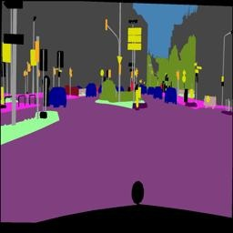
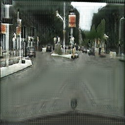
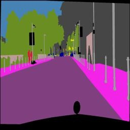
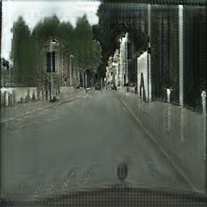

# Reverse-Segmentation-GAN
Cycle GAN for reverse segmentation of images or Image translation.  
Image-to-image translation is a class of vision and graphics problems where the goal is to learn the mapping between an input image and an output image using a training set of aligned image pairs. However, for many tasks, paired training data will not be available. This architecture deals with unpaired images in unique way.
### Adversarial Networks
We have a generator network and discriminator network playing against each other. The generator tries to produce samples from the desired distribution and the discriminator tries to predict if the sample is from the actual distribution or produced by the generator. The generator and discriminator are trained jointly. The effect this has is that eventually the generator learns to approximate the underlying distribution completely and the discriminator is left guessing randomly.
### Cycle Consistency Loss
The above adversarial method of training has a problem though. Quoting the authors of the original paper:
Adversarial training can, in theory, learn mappings G and F that produce outputs identically distributed as target domains Y and X respectively. However, with large enough capacity, a network can map the same set of input images to any random permutation of images in the target domain, where any of the learned mappings can induce an output distribution that matches the target distribution. Thus, an adversarial loss alone cannot guarantee that the learned function can map an individual input xi to a desired output yi. 
To regularize the model, the authors introduce the constraint of cycle-consistency - if we transform from source distribution to target and then back again to source distribution, we should get samples from our source distribution.
To summarize we add a loss term to our overall loss function which is defined as MSE(G(F(X)), X) 
### Model schematic diagram:

### Sample Images
#### Here I have used this model for reverse segmenting an image, i.e convert a pixel-segmented image to original image. Although the data is paired, for training I haven't used align parameter for illustrating the main highlight i.e unpaired image translation.
;  
; 
#### The images are not high resolution because I had used RandomCrop of 100 on these 256x256 sized images while training and only 500 images (each side) were used to train the model due to computational limitations. GAN's are hard to train. Training this far with 200 epochs took 5 hours on 32 GB, Tesla K80 GCP instance. The authors of the original paper had trained it on much larger dataset on powerful GPU's and the model created sharp and crisp images like these!

### References:
 

### Requirements:
PyTorch 
Visdom 
